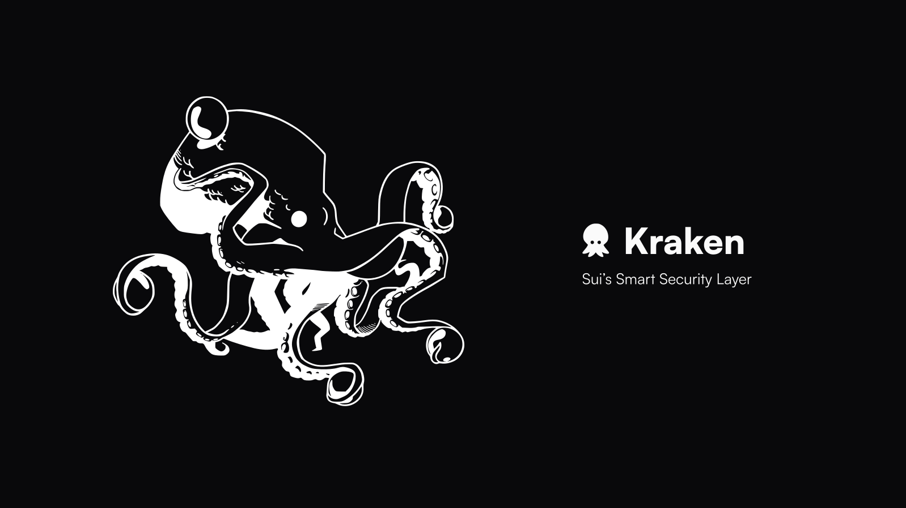
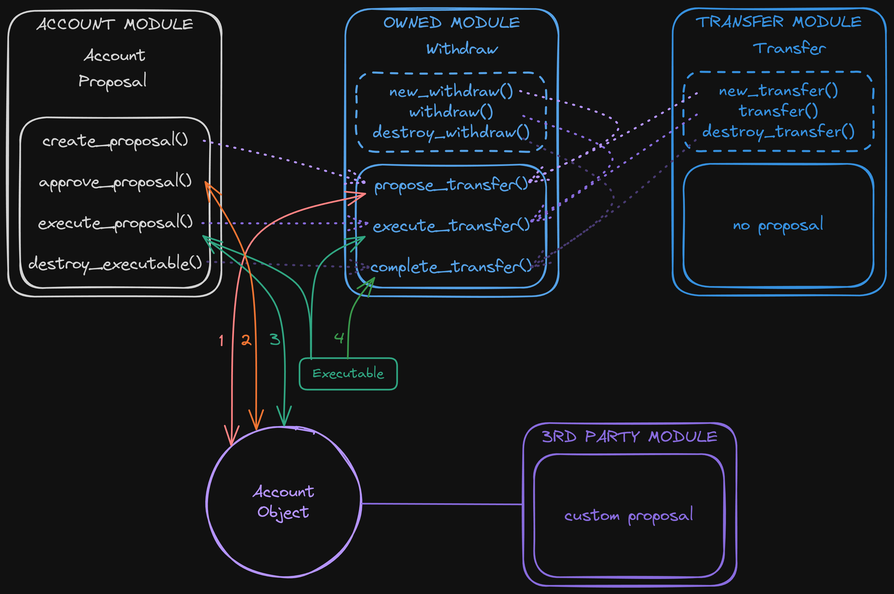

# Kraken - Account Abstraction on Sui

## Project Overview

### Abstract

This project provides the security layer of Sui, an account abstraction protocol enabling organizations to safely interact with valuable assets and programmable objects via Smart Accounts.

Smart Accounts can have different configurations such as Multisig, DAO, and anything else you can imagine.

### Goals

Our vision is to create a robust and modular infrastructure that not only supports a wide array of applications but also enables the development of our own suite of secure and friendly platforms, starting with Multisig and DAO.

The primary goal is to provide friendly and secure interfaces for any organization to manage assets held in Treasuries or Kiosks, as well as packages and more. Businesses should be able to handle all their processes on-chain with ease and in all safety. That is why Smart Accounts will support all existing Sui objects such as Kiosks, UpgradeCap, TreasuryCap but also TransferPolicyCap, Display object and any other custom objects people come up with. 

The second criteria we set is complete modularity and extensability. We don't want people to be limited by our decisions. 
So, when creating a smart account it can be configured in different ways. Meaning the user can choose a Multisig-like configuration like [Squads](https://squads.so/), with members, weights, roles and thresholds. But they could also choose to set up the smart account as a dao governed by a coin or a nft. In any case, the smart account will always be the same Account object with the same apis.

Then account.tech provides many built-in features such as payments and vesting, transfers and airdrops, nft management via kiosks, spending limits with Treasuries, and anything related to package management with UpgradeCap.

But if a developer wants to execute specific actions with his smart account that are not included by default, he can easily define custom actions and use them within a custom proposal.
This project will eventually include different front-ends as well as a [Typescript SDK](https://github.com/gmove-io/kraken-sdk) and a CLI to streamline operations.

### Configurations

Multisig Smart Accounts are built from the ground up for teams and developers. The protocol provides all functionalities needed to manage on-chain projects, assets and funds. Parameters are fully customizable with members, weights, roles and thresholds management.

DAO Smart Accounts will come next.

### Features

- **On chain Registration**: Create a User profile object to track your multisigs on-chain. Add a username and profile picture to be displayed on the front-ends. Send and receive invites to join multisigs on-chain. 
- **Configuration**: Set up the Smart Account's configuration based on the type of Smart Account. For each proposal, define an expiration epoch and schedule an execution time. Explicitly migrate to new versions of the Kraken Extensions to benefit from new features built by the Good Move team and the community.
- **Asset Management**: Manage and send coins or any other object type owned by an Account in a natural way. Containerize and spend coins with Treasuries, and NFTs with Kiosks. Transfer and de/list NFTs from/to the Account's Kiosks. Easily hide spam objects owned by a Smart Account.
- **Payment Streams**: Pay people by creating streams that will send an amount of coin to an address at regular frequency. Cancel the payment at any time. Make a delivery by enabling a recipient to claim a payment from an escrow. Retrieve the payment if you made a mistake and if it hasn't been claimed.
- **Currency Management**: Lock a TreasuryCap and enable/disable the minting and/or burning of Coins. Update its CoinMetadata. Send and airdrop minted coins.
- **Access Control**: Define any action in your own module and securely manage its execution via the Account. Check out the [examples](./package/examples/sources/access_control.move). Secure your Caps access within the Account.
- **Package Upgrades**: Lock your UpgradeCaps in your Account to enforce agreement on the code to be published. Any rule(s) can be defined for an UpgradeLock. An optional time-lock built-in policy is provided by default to protect your users. The SDK will facilite the display of upcoming upgrades on your dapp.
- **Validator Monitoring**: Safely manage your validator. (TODO)
- **Interact with dApps**: Easily interact with dApps on Sui that are integrated to the Smart Account. Stake, Swap, Lend your assets, and more. (TODO)

## Architecture

### Core Packages 

The Move code has been designed to be highly modular. There are currently 4 packages but there could be many more, including from external contributors. 

The first one is `AccountProtocol` managing the multisig `Account` object and the proposal process. The `Account` object encapsulates 3 custom types managing its dependencies, metadata (incl. name) and proposals.

These fields can be accessed mutably from the core packages only. Core Packages are `AccountProtocol` `AccountConfig` and `AccountActions`. The latter defines proposals to modify `Account` fields.

### Extensions

Since anyone can create modules to extend the protocol, smart accounts have to explicitly add which package or dependency is authorized to modify its state. For this reason, there is an AccountExtensions package which is managing an Extensions object tracking allowed packages and their different versions. 

Account members must add the dependencies they want to use and when upgraded, they have to explicitly migrate to the version they wish to use. So unlike on Solana, developers won't be able to scam smart accounts by upgrading to malicious code. 

In Extensions, three of our packages are defined as core dependencies. AccountProtocol handles the logic of the smart accounts and the proposals. AccountConfig defines multiple parameters (like Multisig or DAO) for accounts and how to resolve the proposal before execution, and AccountActions defines built-in features like dependencies management. Core dependencies are the only one that have privileged access to the Account objects. With this pattern, we replicate the behavior of `public(package)` but across multiple packages.

### Module Structure

Each module may define none or multiple actions and/or proposals. Each Proposal has an associated `NameProposal` witness type used for many checks (see below). Public functions are divided in three parts: 

- member functions can be executed without proposals by all members of the Account.
- proposal functions are used to create proposals and execute actions upon approval.
- action functions are the library functions and can be used to compose proposals.

### Authentification

Before creating a proposal or execute any member-only action, a user must authenticate himself as a valid member of the Account with an optional role. It creates a hot potato which is destroyed upon verification.

### Issuer

Each proposal stores a special Issuer type constructed from an associated witness (struct with drop ability), an optional name and the address of the Account. This Issuer is used to enforce the correct and complete execution of the proposal, facilitate parsing on front-ends and define roles.  

These roles can be added to members who can then bypass the global threshold if the role threshold is reached. Members have weights enabling super admins and more.

### Object handling

An `Account` can possess and interact with objects in two different ways.

Using transfer to object (tto), we replicated the behavior of classic Sui accounts, enabling Accounts to receive, own and interact any kind of object.

Then we separate managed assets, which are special and standardized objects from the Sui Framework and more. Those are attached as dynamic fields to `Account` objects allowing us to abstract, secure and provide granular control to many processes such as upgrading packages, managing a Coin, handling access control, etc.

This design allows us to manage the packages with a special `Account` object which is instatiated upon deployment and uses this access control mechanism.

## Usage

### Proposal Flow

1. User must authenticate himself by calling `multisig::authenticate()` or similar in anothe configuration module.
2. Then the outcome can be initialized for the configuration by calling `multisig::new_outcome()`.
3. Proposals are then created via `propose_` functions within modules, by stacking one or more predefined actions.
4. Members of the Account can approve the proposal by calling `multisig::approve_proposal`. Optionally, members can `multisig::remove_approval`. This increases the `global_weight` field of the Proposal and the `role_weight` field if the member posseses the role.
5. Once the threshold is reached, the proposal is executed by calling the `multisig::execute_proposal` function, validating the `Outcome` and an `Executable` hot potato wrapping the action bag and `Issuer`.
6. Actions are executed by passing the `Executable hot potato` to the `execute_` function of the module.
7. Finally, all actions and the `Executable` hot potato must be destroyed via `complete_` functions within the same module as the proposal was created (if it hasn't been consumed during execution).

### Actions

Actions are struct with `store` only ability. These actions are meant to be stacked in proposals and executed sequentially. They all have a similar interface to handle their lifecycle, which is used to compose proposals. 

Actions are created by passing a `Proposal` and are destroyed from within the `Executable`. This way we ensure they can't be dropped or stored and must be executed as expected.

The `account` module defines a common interface for adding actions to a Proposal which is stored in the `Account` VecMap. The keys are supposed to be unique human-readable identifiers to display on the frontends.

### Integration

Anyone can define custom actions and proposals in their own package or separate library! Please refer to the [examples](./examples/) for some use cases.

Create a new proposal by defining a `propose_actions()` function that will instantiate a Proposal containing the actions of your choice. Then write a `execute_actions()` function that will execute the actions according to their logic. Add a `complete_actions()` function to destroy the actions and the `Executable` hot potato if it can't be done during the precedent step (if you need to loop over `execute_actions()` for instance).

Create new actions by defining structs with store only ability carrying the data you need. These actions are instantiated via `new_action()` functions that takes a mutable reference to the proposal. Then they are executed by calling `action()` with the `Executable` hot potato as argument. Finally the action execution should be validated and destroyed by calling `destroy_action()`.

### Modules

The project is splitted in multiple packages to improve the security. Indeed, the core packages have no external dependency so they are less vulnerable and don't necessitate regular upgrades because of third party packages. 

Furthermore, the `AccountProtocol` shouldn't need to be upgraded since its functionalities will not change except with a major evolution of the protocol. `AccountConfig` will be upgraded to add new configuration options. `AccountActions` will be upgraded to add new features and `AccountExtensions` could be made immutable.

`AccountActions` consists of several modules, with built-in actions and proposals, each handling different aspects of the multisig functionality:

1. **Config**: Enables the modification of the Account settings such as member addition or removal, threshold changes, roles addition, and name update, as well as the Account dependency management.

2. **Currency**: Allows creators to lock a TreasuryCap and limit its permissions. Members can mint coins and use them in transfers or payments. Mint can be disabled upon lock.

3. **Kiosk**: Handles the creation of a Kiosk, which is a container for NFTs owned by the Account. The Kiosk module can be used to move NFTs between the Account and other Kiosks. NFTs can listed and delisted from the Kiosk and profits can be withdrawn. Each Kiosk has a matching role that can be assign to members.

4. **Owned**: Manages access to objects owned by the multisig, allowing them to be withdrawn or borrowed through proposals. Withdrawn objects can be used in transfers and payments.

5. **Payments**: Defines APIs for creating payments streams and escrows for a Coin that are used in other modules like `owned`, `currency` and `treasury`. The payment is done by sending an amount of the coin to the recipient at a regular interval until the balance is empty. Alternatively, the Coin could be manually claimed. Paid or escrowed coins can be cancelled and retrieved by members as long as they have not been sent or claimed.

6. **Transfers**: Defines APIs for transferring objects from an Account. These objects are retrieved by withdrawing them from owned, spending them from treasury, minting them from currency, or anything else you want to define.

7. **Treasury**: Allows members to open containers for Coins and assign members to them via roles. Coins held there can be transferred, paid and more using the Spend action.

8. **Upgrade Policies**: Secure UpgradeCaps by locking them into the Multisig and define custom rules for the UpgradeLock. It provides a default TimeLock rule. Members can propose to upgrade and restrict their packages.

## Additional Information

### Considerations

Currently, only the transaction digest is accessible within Move. Since it includes the gas object, we can't use it to execute arbitrary move call via the smart contract multisig.

[A SIP](https://github.com/sui-foundation/sips/pull/37) has been submitted by our team to propose to expose more data from the transaction context on chain.    

### Contributing

Contributions are welcome! If you have suggestions for improvements or new features, please open an issue or submit a pull request. Please feel free to reach out [on Twitter](https://twitter.com/BL0CKRUNNER) if you have any question.

### License

This project is licensed under the MIT License - see the [LICENSE](LICENSE) file for details.

