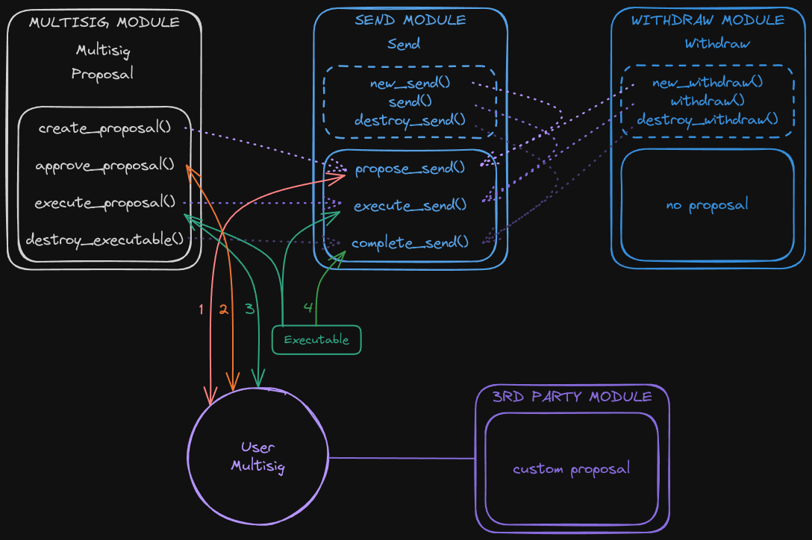

# Kraken - Account Abstraction on Sui

## Project Overview

### Abstract

The Kraken project aims to provide a versatile ecosystem of apps with native and smart-contract based multisig mechanisms at its center, tailored for both teams and individuals on the Sui blockchain.

This package implements a multisig-like smart contract based system on the Sui blockchain. A multi-signature mechanism requires multiple parties to agree on actions before they can be executed. It adds an additional layer of security and is recommended for managing treasuries and smart contracts.

### Goals

The Kraken's Smart Multisig is built from the ground up for teams and developers. The product provides all functionalities needed to manage multiple projects and funds.
A fully featured Account Abstraction solution with social recovery for individuals will be built on top using zkLogin, native multisig, transfer to object and any other features replicating the behavior of a classic account. We call it the Kraken's Smart Account.

The primary goal is to enable a broad spectrum of on-chain interactions, surpassing the limitations of existing solutions. It is also easily integrable with 3rd party packages enabling the creation and management of custom actions and proposals. This project will eventually include different front-ends as well as a [Typescript SDK](https://github.com/gmove-io/kraken-sdk) and a CLI to streamline operations.

### Features

- **On chain Registration**: Create an on-chain Kraken account to track your multisigs in a decentralized way. Add a username and profile picture to be displayed on the apps. Send and receive on-chain invites to join multisigs. 
- **Configuration**: Set up the Multisig's name, members with their weight, threshold, proposal expiration and scheduled execution. Explicitly migrate to new versions of the Kraken package to benefit from new features.
- **Asset Management**: Manage and send coins or any other object types in a natural way. Objects that are delivered instead of sent can be retrieved anytime. Transfer and de/list NFTs from/to the Multisig's Kiosk. Easily hide spam objects owned by a Multisig.
- **Payment Streams**: Pay people by creating streams that will send an amount of coin to an address at regular frequency. Cancel the payment at any time.
- **Access Control**: Define any action in your own module and securely manage their execution via the Multisig. Check out the [examples](TODO:).
- **Package Upgrades**: Lock your UpgradeCaps in your Multisig to enforce agreement on the code to be published. Any rule(s) can be defined for an UpgradeLock. An optional time-lock built-in policy is provided by default to protect your users. The SDK will facilite the display of upcoming upgrades on your dapp.
- **Validator management**: Safely manage your validator. (TODO)
- **Interact with dApps**: Easily interact with dApps on Sui that are integrated to the Multisig. Stake, Swap, Lend your assets, and more. (TODO)

## Usage

### Flow

1. Proposals are created via `propose_` functions within modules, by stacking one or more predefined actions.
2. Members of the Multisig can approve the proposal by calling `multisig::approve_proposal`. Optionally, members can `multisig::remove_approval`.
3. Once the threshold is reached, the proposal is executed by calling the `execute_proposal` function, returning an `Executable hot potato` wrapping the action bag.
4. Actions are executed by passing the `Executable hot potato` to the `execute_` function of the module.
5. Finally, all actions and the `Executable hot potato` must be destroyed via `complete_` functions within the same module as the proposal was created (if it hasn't been consumed during execution).

### Architecture

The multisig module define a common interface for adding actions to a Proposal which is stored in the Multisig VecMap. The keys are supposed to be human-readable identifiers to display on the frontends.

Modules may define none or multiple actions. They are structs with store ability meant to be attached to a Proposal. These modules are divided in 3 parts:

- member functions can be executed without proposals by all members of the multisig.
- proposal functions are used to create proposals and execute actions upon approval.
- action functions are the library functions and can be used to compose proposals.

### Integration

Anyone can define custom actions and proposals in their own package or separate library! 

Create a new proposal by defining a `propose_action()` function that will instantiate a Proposal containing the actions of your choice. Then write a `execute_action()` function that will execute the actions according to their logic. Add a `complete_action()` function to destroy the actions and the `Executable` hot potato if it can't be done during the precedent step (if you need to loop over `execute_action()` for instance).

Create new actions by defining structs with store only ability carrying the data you need. These actions are instantiated via `new_action()` functions that takes a mutable reference to the proposal. Then they are executed by calling `action()` with the `Executable` hot potato as argument. Finally the action execution should be validated and destroyed by calling `destroy_action()`.

### Modules

The project consists of several modules, with built-in actions and proposals, each handling different aspects of the multisig functionality:

1. **Multisig**: Core module managing the multisig and proposals. It handles the creation of multisig objects, and the entire flow for executing proposals with actions.

2. **Account**: Handles the creation of a non-transferable account for each user to track their Multisigs. Allows members to send on-chain invites to new members.

3. **Config**: Enables the modification of multisig settings such as member addition or removal, threshold changes and name update, as well as the multisig objects upgrade.

4. **Owned**: Manages access to objects owned by the multisig, allowing them to be withdrawn or borrowed through proposals.

5. **Coin Operations**: Handles the merging and splitting of coins in the multisig. Can be used to prepare a Proposal with coins that have the exact amount needed.

6. **Transfers**: Allows the transfer of assets owned in the multisig treasury. Objects can also be delivered, meaning the recipient has to claim the objects otherwise the Multisig can retrieve them.

7. **Payments**: Handles the creation of a payment stream for a coin. The payment is done by sending an amount of the coin to the recipient at a regular interval until the balance is empty. It can be cancelled by the multisig member.

8. **Kiosk**: Handles the creation of a Kiosk, which is a container for NFTs owned by the Multisig. The Kiosk module can be used to move NFTs between the Multisig and other Kiosks. NFTs can listed and delisted from the Kiosk and profits can be withdrawn.

9. **Upgrade Policies**: Secure UpgradeCaps by locking them into the Multisig and define custom rules for the UpgradeLock.

## Additional Information

### Considerations
Currently, only the transaction digest is accessible within Move. Since it includes the gas object, we can't use it to execute arbitrary move call via the smart contract multisig.

If additional data (inputs and commands) about the executed transaction is provided on chain via TxContext, we wouldn't need to use the native multisig.  

### Contributing

Contributions are welcome! If you have suggestions for improvements or new features, please open an issue or submit a pull request. Please feel free to reach out [on Twitter](https://twitter.com/BL0CKRUNNER) if you have any questions.

### License

This project is licensed under the MIT License - see the [LICENSE](LICENSE) file for details.

